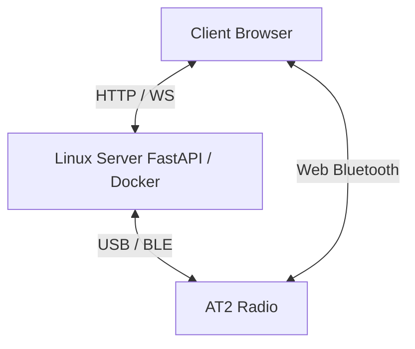

  <h1 align="center">AT2 Bridge</h1>

<p align="center">
  <!-- Status -->
  
  
  <!-- Python -->
  
  
  <!-- FastAPI -->
  
  
  <!-- Docker -->
  
  
  <!-- Tests -->
  
  
  <!-- Hardware -->
  
  
  <!-- License (linked to the repo) -->
  <a href="https://github.com/dx9674hnxw-spec/at2-bridge/blob/main/LICENSE">
    
  </a>
</p>

Self-hosted web application (Docker) to control a bidirectional **Alervites/Baofeng AT2** radio from a Linux server, or directly from the browser via local BLE — channels (read/write confirmed working), device settings, offline messaging (text/image/voice), real-time PTT, position/SOS, authentication.

> [!WARNING]
> **Community project, not affiliated with Baofeng/Alervites.** Protocol reconstructed through reverse engineering. No guarantee of full compatibility — test carefully.

> [!IMPORTANT]
> **On the distinction between "acknowledgment" and "confirmed working":** the radio responds to many commands with a frame-level acknowledgment (`family | 0x80`, valid CRC). **This alone does not prove the action actually happened** — a concrete example illustrates this in this project: the old channel-selection command got a coherent acknowledgment, but very likely wrote an entirely different parameter (the dual-watch channel), not the active channel. A feature is only marked ✅ in this document once it has been verified through a means independent of the protocol itself (an independent read-back showing the change, reception on a second radio, an observable radio behavior — the AT2 has no screen).

## Features

> [!TIP]
>###  Confirmed working on real hardware
>
>- **Channel read and write** — one channel at a time, via the protocol dialect found in the official Windows CPS (see "Protocol origin" below). Frequencies, CTCSS/DCS tones, bandwidth, power, scan, analog/digital mode, encryption key, busy lock, frequency hop: every field confirmed by cross-checking against a configuration export from the official CPS.
>- **Importing an XML export from the official CPS** into the interface's channel table (only populates the screen, never writes to the radio automatically).
>- **Offline text/voice/image messaging** (server mode) — construction, decoding, and reassembly of all three formats.
>- **Local BLE mode (Web Bluetooth)** — direct browser↔radio connection with no intermediate server: channel selection, volume, sending/receiving text/voice/image messages, channel read/write.
>- **Frame codec** (both protocol dialects, see below), AMR-NB codec (native binding server-side, JS/WebAssembly port client-side), HMAC token authentication, local storage (channel names, known devices), clean error handling (no traceback exposed to the client).
>- **64 unit tests** — `app/tests/test_protocol.py`, including dedicated tests using byte sequences actually exchanged with the hardware as reference, byte-exact tests transcribed directly from the reference Android app's `At2Commands.kt` for every device-setting command below, tests for the ack-retry/chunk-pacing message-sending logic and the reassembly edge cases (padded last chunk, missing start frame, out-of-range seq) described below, and tests for the bounded-memory/TTL eviction of abandoned partial messages (see "Bounded memory for abandoned partial messages" below).

> [!WARNING]
>###  Implemented, pending hardware confirmation
>
>- **Real-time PTT in local BLE mode** — AMR-NB encoding and decoding entirely in the browser (see dedicated section below). PTT frames were correctly built, paced, and transmitted, but the radio never actually keyed up: comparing against the reference Android app revealed that a distinct "key transmitter on/off" command (`family 0x02 / command 0x04`, subtype `0x02`, plus a one-time "offline session on" subtype `0x07`) was missing entirely — voice packets alone are apparently not enough to make the radio transmit. Both commands are now sent (key-on before the first voice packet, key-off after the last) in `app/protocol/ptt.py`, `app/device.py::PttSession`, `app/static/protocol.js` and `app/static/ble-client.js`. **Still not confirmed on physical hardware** — please test and report back.
>- **Channel selection (quick select, both server and local BLE mode)** — **fixed a byte-format bug**: this command was one byte short of the reference app's real frame (missing the fixed `command=0x02` byte, so the radio saw `command=0x0E` directly instead of `command=0x02, subtype=0x0E`). This is almost certainly what the former "old channel-selection command" note below was describing. Byte-exact against `At2Commands.kt::selectChannel` now (see `test_select_channel_matches_reference_app`) — **still needs a real hardware re-test** to confirm the fix actually restores correct behavior.
>- **Volume** — **fixed a byte-format bug**: was missing a `0x01` subtype byte the reference app always sends (`app/protocol/commands.py::set_volume`/`protocol.js::setVolume`). The shorter frame may well have been silently tolerated by the radio (this is why it was previously listed as "confirmed working" below) — re-test to be sure the fix doesn't change that.
>- **Prompt tone (confirmation beep) setting** — **fixed a more serious byte-format bug**: the old command used `family=0x02, command=0x04` — the *same* family/command pair as text messaging and PTT — with a body that could be mistaken for the start of a text message. Now uses the reference app's real `family=0x02, command=0x01, subtype=0x04`, with no such collision.
>- **Dual Watch, prompt language (Chinese/English), TX interval ("hop")** — newly added (`app/protocol/commands.py`, exposed as `PUT /api/device/dual-watch(/channel|/focus)`, `/prompt-language`, `/tx-interval`, server mode only), ported byte-for-byte from the reference app. Like every other advanced setting below, never verified by independent read-back.
>- **Device settings other than volume** (squelch, VOX, VOX sensitivity, TX timeout, TX interval, TX inhibit, noise reduction, prompt tone, prompt language, device name, Smart Link, Dual Watch) — a command is sent and an acknowledgment comes back, but none has been verified by independent read-back. There is currently no "read settings back from the radio" feature at all (the `query_*` builders in `commands.py` exist but aren't wired to any endpoint yet).
>- **Real-time PTT in server mode** — same missing key-on/key-off commands as above, now added to `app/device.py::PttSession`; never verified end-to-end on hardware.
>- **Offline messaging: reworked end to end.** The whole off-grid messaging system was overhauled, UI included (screenshots/details below):
>  - **Sending reliability** — was fire-and-forget (each frame sent with a fixed delay, no check that the radio actually got it); now every frame is sent and its ack awaited before the next one goes out, with up to 3 retries on a dropped frame (`app/device.py::_send_message_frames_with_ack`, `app/static/ble-client.js::sendFramesWithAck`) — ported from `At2ProtocolExecutor.kt::sendOfflineBusinessFrameWithAck`. A send that ultimately fails now raises a clear error instead of silently losing frames.
>  - **Missing inter-chunk pacing, confirmed live 05/09/2026** — even with the ack-retry above, image messages never arrived on the receiving radio at all, and voice messages arrived as a corrupt partial reassembly, while short text messages worked fine. Root cause: the ack we wait for only confirms the radio *queued* a chunk over BLE, not that it finished actually keying up and transmitting it over RF — so chunks were pushed to the radio far faster than it can physically send them on air, and most of a large message's chunks never left the radio at all. Fixed by porting the reference app's fixed-cadence chunk pacing (`At2ProtocolExecutor.kt`'s `OFFLINE_*_CHUNK_PERIOD_MS`/`delayUntil`, ~360-400ms between chunks depending on message type) into both `app/device.py::_send_message_frames_with_ack` and `app/static/ble-client.js::sendFramesWithAck`, on top of (not instead of) the ack-retry.
>  - **Reassembly correctness** — two real bugs, fixed by comparing against `OfflineMessageAssembler.kt`: reassembled messages were never trimmed to their self-declared length (risking trailing garbage if the radio pads its last chunk, which neither software encoder does but nothing guarantees the radio doesn't), and a chunk arriving without its start frame having been seen (dropped first packet, or joining mid-transmission) was silently discarded forever instead of still being reassembled once enough of them arrive. Both fixed in `app/protocol/messages.py`.
>  - **Bounded memory for abandoned partial messages** — the orphan-chunk recovery above introduced a new problem: a pending entry was kept forever for any chunk whose start frame was never seen, with no limit and no timeout. Since crafting such a chunk needs no authentication at the protocol level, any RF/BLE transmitter in range could grow this table without bound — the shared server process in server mode, the browser tab in local BLE mode. Fixed with a cap (64 concurrent pending messages) plus a 120s TTL, both evicted from oldest-first right before a new entry is inserted (`app/protocol/messages.py`, `app/static/protocol.js`); a real connection normally has at most ~1 message in flight, so neither limit affects normal use. This closes the "cleanup of abandoned partial messages" item formerly listed in the Roadmap below.
>  - **Concurrent sends no longer interleave** — `_send_message_frames_with_ack()`'s ack-wait state was a single shared `asyncio.Event` with no lock around the send-and-wait cycle: two overlapping message sends (two browser tabs, two API calls) could interleave their frames on the wire and let one message's radio acknowledgment satisfy the other's wait, silently corrupting/truncating both with no error surfaced anywhere. Now serialized with an `asyncio.Lock` (`app/device.py::DeviceManager._message_send_lock`).
>  - **Local BLE mode could not receive messages at all** — every incoming packet was only ever logged as raw family/command hex; text/voice/image reception was server-mode only. Fixed by porting the (now-corrected) reassembly logic to JavaScript, byte-exact-validated against the Python implementation (`app/static/protocol.js::MessageAssembler`, wired up in `app/static/ble-client.js`). This means two browser tabs, each in local BLE mode connected to a different physical radio, can now both send and receive on their respective radio.
>  - **Local BLE mode could not send voice or image messages at all** (text only) — there was no AMR encoder or image resizer running anywhere near the browser for this path (server mode has Pillow + a native AMR binding to do it). Fixed: voice notes are AMR-encoded client-side via the same codec already used for live PTT (`AT2BleClient.sendVoice()`), and images are resized/re-encoded client-side via `<canvas>` to match the server's target (300px long edge, JPEG quality ~75) before sending (`AT2BleClient.sendImage()`) — both byte-exact-validated (JS-encode → Python-decode) against `app/protocol/messages.py`.
>  - **UI rewritten** as grouped conversations — one thread per radio channel (channels double as chat rooms, ATAK VX-inspired, brought closer to `Demo/at2-bridge-demo-v6.html`'s mockup): a channel sidebar, a live status grid (frequency/mode/tone/encryption) for the selected channel, an inline volume slider, and selecting a channel there actually switches the radio's active channel (shared state with the Channels/PTT tabs). Message history now persists locally (`localStorage`) across reloads — there was no persistence at all before.
>  - **Voice message playback** — received messages are decoded (AMR → PCM, client-side) and playable via a button on the bubble (previously text-only, "message received, no player"); sent voice notes are playable too now, from the raw PCM kept in memory (no AMR round-trip needed for our own audio).
>  - Confirmed live (05/09/2026, local BLE, two tabs/two radios): text reception works reliably. Image/voice reception should now work with the pacing fix above — **still needs a re-test to confirm**.
>- **Position/SOS** — relies on the text messaging channel (no structured "Position" type exists in the real protocol).
>- **Reconnecting to known devices** — **fixed a UI bug** (05/09/2026): clicking "Connecter" on a known BLE-local radio already connected correctly in the background, but the Serveur/BLE local mode toggle never followed, so the visible panel (status text, connect/disconnect button) stayed on whichever mode was showing before — looking like nothing happened until switching mode by hand. `reconnectKnownDevice()` (`app/static/app.js`) now switches the mode toggle to match the device's own transport before connecting.
>- **PTT panel reworked** (05/09/2026): the always-empty device-name placeholder ("—", never actually populated) was dropped, the channel-property icons (power/bandwidth/scan/mode) moved to their own row so the channel switcher stays one line, and a "?" button now surfaces a legend for those icons — closer to the requested mockup, no function removed.
>- **New: passive "someone is talking" RX indicator** — previously the only way to see any incoming voice activity at all was to already be transmitting yourself (`/ws/ptt` only forwards incoming audio to a client that also keyed up its own PTT session), which defeats the point of checking whether the channel is busy before pressing PTT. Added a receive-only signal, server mode via a dedicated `/ws/ptt-rx` websocket that never keys the local transmitter (`app/main.py`), local BLE mode by watching the existing packet stream for incoming voice activity (`app/static/protocol.js::isIncomingRfActivity`) — both light up the same "RX" badge and waveform (`app/static/style.css`'s already-defined-but-previously-unused `.rf-indicator.rx` / `.ptt-wave.rx-active` styles) whenever the radio receives someone else's transmission, without needing to press PTT.
>  - **Fixed on first live test (05/09/2026, local BLE)**: real incoming voice traffic didn't decode as `family=0x02/command=0x04` (the PTT voice signature ported from the Android reference, only ever confirmed for frames *we* build/send) — it decoded as `family=0x91/command=0x02` instead, at the ~100ms cadence matching the known voice packet pacing. Root cause: `decodeFrame()` only implements the "legacy" 1-byte-length dialect, and a genuine CPS-dialect frame (2-byte length, no leading `0x00` pad) with a body under 256 bytes decodes cleanly under that same logic too — deterministically, not by chance, since the unused high length byte reads as the legacy dialect's expected pad (this is the exact same quirk `readChannel()` already relies on for channel-read replies, see `ble-client.js`). This radio appears to genuinely frame live incoming voice in the CPS dialect. `isIncomingRfActivity()` now also matches this signature for the indicator (audio decoding/playback for this traffic is untouched — its real payload shape hasn't been reverse-engineered). Same root cause likely affects server-mode's `/ws/ptt-rx` too, **not yet fixed there** — untested since this live test was local-BLE-only.

> [!CAUTION]
>###  Confirmed not working / abandoned
>
>- **Bulk codeplug read or write in a single command** — the radio simply does not respond to this kind of request at all. The real protocol works one channel at a time (confirmed by decompiling the official Windows CPS), which is what this application now uses. (Side note: this legacy bulk-write path also has the same kind of missing-opcode-byte bug as the ones fixed above — `write_channel_chunk`/`clear_channel`/`query_channel_config` are each missing a leading subtype byte the reference app sends. Left unfixed since the whole path is already abandoned in favor of the CPS dialect below, but noted here for anyone revisiting it.)

> [!CAUTION]
>###  Not implemented / Roadmap
>
>- **Structured "Position" message type** — currently formatted text.
>- **Managing multiple radios simultaneously** — only one active connection at a time server-side. In local BLE mode this is less of a hard limit: each browser tab holds its own independent Web Bluetooth connection, so e.g. two tabs on the same computer, each connected to a different physical radio, can each send/receive messages on their own radio (local BLE mode now supports receiving, see above) — just not through the same tab/connection.
>- **Video streaming / periodic photos** — not implemented; the protocol's throughput (≈330 bytes/s for messaging, 4.8 kbps for PTT) makes real video unrealistic.
>- **Importing/exporting multiple configuration profiles, messaging groups** — under consideration, nothing started.

## The protocol: two frame dialects

The general envelope (`AA55 ... 77EE`, CRC16-CCITT init `0x1234` poly `0x1021`) is shared, but two genuinely distinct internal structures coexist on the wire, depending on the feature:

- **"Legacy" dialect** (ported from the reference Android app's BLE protocol): 1-byte length, body prefixed with a `0x00` byte. Used for offline messaging, real-time PTT, and device settings.
- **"CPS" dialect** (found by decompiling the official Windows CPS): 2-byte length, no leading byte. Used for reading/writing an individual channel.

This wasn't obvious at first — the two dialects were mistaken for one another several times during the reverse-engineering phase before being clearly distinguished and separately confirmed on real hardware.

## PTT in local BLE mode

PTT turned out to be an **exclusively BLE** feature: the official Windows CPS, which only handles codeplug programming, contains no real-time audio handling code at all. Without a Bluetooth module on the server, PTT in local BLE mode must therefore encode/decode audio (AMR-NB) directly in the browser — which this project does via [`opencore-amr-js`](https://github.com/yxl/opencore-amr-js) (Apache 2.0), a WebAssembly port of the same native codec already used server-side.

## Off-grid messaging: channels as chat rooms

The messaging UI treats each of the radio's 30 channels as a "group" (a chat room), inspired by `Demo/at2-bridge-demo-v6.html`'s mockup: a sidebar lists all 30, each showing its local name (or `Canal NN`), frequency, and local message count, and clicking one actually switches the radio's active channel — this is not just a UI convenience, it reflects the real protocol constraint that a message can only be sent/received on whichever channel the radio is currently tuned to. There is no per-channel addressing on the wire at all, so "which group a message belongs to" is a purely local (client-side) bucketing by the channel that was active at send/receive time; message history is kept in `localStorage` per browser (not synced anywhere).

## Architecture



## Web Bluetooth

Local BLE mode runs in the user's browser. The Linux server is not in the Bluetooth path in this mode: the radio therefore needs to be within Bluetooth range of the computer or phone displaying the web interface.

### Compatible browsers

- Use Chrome or Edge on Windows, macOS, Linux, or Android.
- Firefox does not support Web Bluetooth.
- iOS browsers do not support Web Bluetooth, including Chrome and Edge on iPhone/iPad, since they rely on WebKit.
- On Linux, Web Bluetooth may require enabling experimental browser features depending on the build used.

### HTTPS required

The Web Bluetooth API requires a secure context: HTTPS or `localhost`. **PTT in local BLE mode has the same requirement** for microphone capture (`getUserMedia`), for the same reason.

For development testing on a local network over HTTP, e.g. `http://<server-ip>:2910`, Chrome can be given a local exception:

1. Open `chrome://flags/#unsafely-treat-insecure-origin-as-secure`.
2. Add the exact origin, for example:

   ```text
   http://<server-ip>:2910
   ```

3. Enable the flag, then click **Relaunch**.
4. Reload the interface with `Ctrl + F5`.

> [!CAUTION]
> This exception should stay limited to a development environment or a controlled local network. For normal use, placing the application behind valid HTTPS is preferable.

### Starting a scan

1. Close Bluetooth LE Explorer or any application currently connected to the radio.
2. Close Ola Radio or turn off the phone's Bluetooth if it might auto-reconnect to the AT2.
3. Toggle Bluetooth off/on on the radio right before scanning, to restart its BLE advertising.
4. Open the interface in Chrome/Edge from the device with the Bluetooth adapter.
5. Start the local BLE connection.
6. Select an `AT2_...` device, e.g. `AT2_01A`.

## Deployment

```bash
git clone https://github.com/dx9674hnxw-spec/at2-bridge.git
cd at2-bridge
docker compose up -d --build
```

Interface served on `http://<server-ip>:<port>` (container runs in `network_mode: host`; port configurable in `docker-compose.yml`, 8000 by default).

To enable authentication, set `AT2_BRIDGE_PASSWORD` in the container's environment — the frontend then shows a login screen on first access. Without this variable, the interface stays open to anyone who can reach the server (restrict to a trusted network such as Tailscale in that case).

### Required hardware access

- **USB serial**: port typically `/dev/ttyACM0` or `/dev/ttyUSB0`, selectable in the interface.
- **BLE (server mode)**: Bluetooth adapter on the server, BlueZ access via D-Bus (already configured in `docker-compose.yml`).
- **BLE (local mode)**: no server-side hardware required — uses the Bluetooth of the device displaying the web page (see the "Web Bluetooth" section above).

### Local development (without Docker)

```bash
python -m venv .venv && source .venv/bin/activate
pip install -r requirements.txt
uvicorn app.main:app --reload
```

### Tests

```bash
python -m pytest app/tests -v
```

## Known limitations

- **A frame-level acknowledgment does not prove an action actually happened on the radio** — see the note near the top of this document.
- Real-time PTT (server and BLE) has never been confirmed working end-to-end on real hardware, despite a complete and otherwise-tested implementation.
- Device settings other than volume have never been verified by independent read-back.
- Web Bluetooth unavailable on all iOS browsers (Apple/WebKit restriction) and on Firefox.
- Only one active radio connection at a time server-side.
- Authentication protects the API and WebSockets via token, but remains a single shared password (no multi-user accounts).

## Protocol origin

Three cross-referenced sources:

1. Decompiling the official Windows CPS (Electron) — revealed the real format for reading/writing an individual channel (the "CPS dialect").
2. Source code of [`Baofeng-ALERVITES-AT2-Android`](https://github.com/byf3332/Baofeng-ALERVITES-AT2-Android) (Apache-2.0) — exact CRC16, real BLE UUIDs, offline messaging formats, and real-time PTT protocol (the "legacy dialect").
3. Direct validation on physical hardware — channel read/write confirmed working; a configuration export from the official CPS used to independently validate each decoded field.

## Third-party licenses

Code ported (Kotlin → Python/JS) from [`Baofeng-ALERVITES-AT2-Android`](https://github.com/byf3332/Baofeng-ALERVITES-AT2-Android), Apache 2.0.

AMR-NB codec: `libopencore-amrnb` server-side, and [`opencore-amr-js`](https://github.com/yxl/opencore-amr-js) (a WebAssembly port of the same codec) client-side for PTT in local BLE mode — both Apache 2.0.

See [`NOTICE`](./NOTICE) and [`THIRD_PARTY_NOTICES.md`](./THIRD_PARTY_NOTICES.md) for the full attribution details.

This project's own code is licensed under MIT — see [`LICENSE`](./LICENSE).
