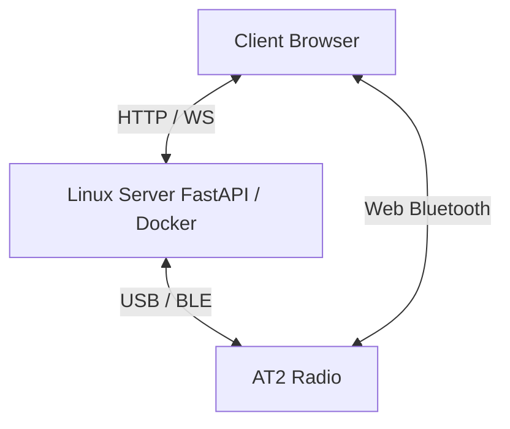

  <h1 align="center">AT2 Bridge</h1>

<p align="center">
  <!-- Status -->
  
  
  <!-- Python -->
  
  
  <!-- FastAPI -->
  
  
  <!-- Docker -->
  
  
  <!-- Tests -->
  
  
  <!-- Hardware -->
  
  
  <!-- License (linked to the repo) -->
  <a href="https://github.com/dx9674hnxw-spec/at2-bridge/blob/main/LICENSE">
    
  </a>
</p>

Self-hosted web application (Docker) to control a bidirectional **Alervites/Baofeng AT2** radio from a Linux server, or directly from the browser via local BLE — channels (read/write confirmed working), device settings, offline messaging (text/image/voice), real-time PTT, position/SOS, authentication.

> [!WARNING]
> **Community project, not affiliated with Baofeng/Alervites.** Protocol reconstructed through reverse engineering. No guarantee of full compatibility — test carefully.

> [!IMPORTANT]
> **On the distinction between "acknowledgment" and "confirmed working":** the radio responds to many commands with a frame-level acknowledgment (`family | 0x80`, valid CRC). **This alone does not prove the action actually happened** — a concrete example illustrates this in this project: the old channel-selection command got a coherent acknowledgment, but very likely wrote an entirely different parameter (the dual-watch channel), not the active channel. A feature is only marked ✅ in this document once it has been verified through a means independent of the protocol itself (an independent read-back showing the change, reception on a second radio, an observable radio behavior — the AT2 has no screen).

## Features

Status legend: ✅ confirmed on real hardware (see the note above on what that requires) · ⚠️ implemented, pending hardware confirmation · ❌ confirmed not working / abandoned · 📋 not implemented yet.

| Feature | Status | Notes |
|---|---|---|
| Channel read/write (one at a time, CPS dialect) | ✅ | Frequency, CTCSS/DCS tone, bandwidth, power, scan, analog/digital mode, encryption key, busy lock, frequency hop — every field cross-checked against a real CPS export. |
| Importing a CPS XML export | ✅ | Only populates the on-screen channel table; never auto-writes to the radio. |
| Offline text/voice/image messaging — construction/decode/reassembly | ✅ | Text confirmed live end-to-end; see [Offline messaging rework](#details-offline-messaging-rework) for image/voice status. |
| Local BLE mode (Web Bluetooth) | ✅ | Channel select, volume, message send/receive, channel read/write — no server involved. |
| Frame codec, AMR-NB codec, HMAC auth, local storage, error handling | ✅ | Both protocol dialects; native AMR binding server-side, JS/WASM port client-side. |
| Test suite | ✅ | 64 unit tests (`app/tests/test_protocol.py`) — hardware-referenced byte sequences, byte-exact transcriptions from the reference Android app's `At2Commands.kt`, ack-retry/chunk-pacing and reassembly edge cases, bounded-memory/TTL eviction. |
| Real-time PTT — local BLE mode | ✅ | Radio key-on/key-off commands were missing entirely, now added — [details](#details-fixes-pending-retest). Still not confirmed on physical hardware. |
| Real-time PTT — server mode | ✅ | Same fix applied; never verified end-to-end on hardware. |
| Quick channel selection | ✅ | Byte-format bug fixed (was one byte short) — [details](#details-fixes-pending-retest), needs a hardware re-test. |
| Volume | ✅ | Byte-format bug fixed (missing subtype byte) — needs a hardware re-test. |
| Prompt tone (confirmation beep) | ✅ | More serious bug fixed: used to collide with the text-message/PTT command. |
| Dual Watch, prompt language, TX interval ("hop") | ✅ | Newly added, ported byte-for-byte from the reference app; never read back. |
| Other device settings (squelch, VOX, TOT, TX inhibit, noise reduction, device name, Smart Link) | ✅ | Command sent + ack received, never verified by independent read-back. |
| Offline messaging reliability rework (ack/retry, chunk pacing, reassembly fixes, memory bound, concurrency lock) | ✅ | Text confirmed live; image/voice should now work with the pacing fix but need a re-test — [full details](#details-offline-messaging-rework). |
| Position/SOS | ✅ | Relies on the text messaging channel — no structured "Position" type exists in the real protocol. |
| Reconnecting to known devices | ✅ | UI bug fixed (mode toggle didn't follow a BLE-local reconnect) — [details](#details-fixes-pending-retest). |
| Passive "someone is talking" RX indicator | ✅ | Fixed once already after a live test; server-mode `/ws/ptt-rx` may need the same fix, untested — [details](#details-fixes-pending-retest). |

## Screenshots

<table>
  <tr>
    <td align="center" width="50%">
      <br>
      <sub><b>Devices</b> — connect via Local BLE or USB serial, hold PTT, position & SOS panel</sub>
    </td>
    <td align="center" width="50%">
      <br>
      <sub><b>Channels</b> — read/write all 30 channels, tones, power, scan, encryption key</sub>
    </td>
  </tr>
  <tr>
    <td align="center" width="50%">
      <br>
      <sub><b>Settings</b> — audio, VOX, TX timeout/hop, dual watch, device name</sub>
    </td>
    <td align="center" width="50%">
      <br>
      <sub><b>Messaging</b> — off-grid chat rooms mapped to radio channels</sub>
    </td>
  </tr>
  <tr>
    <td align="center" width="50%">
      <br>
      <sub><b>Map</b> — positions extracted from received offline beacons</sub>
    </td>
    <td align="center" width="50%">
      <br>
      <sub><b>Log</b> — raw frame debug console, export exchanges</sub>
    </td>
  </tr>
</table>

## The protocol: two frame dialects

The general envelope (`AA55 ... 77EE`, CRC16-CCITT init `0x1234` poly `0x1021`) is shared, but two genuinely distinct internal structures coexist on the wire, depending on the feature:

- **"Legacy" dialect** (ported from the reference Android app's BLE protocol): 1-byte length, body prefixed with a `0x00` byte. Used for offline messaging, real-time PTT, and device settings.
- **"CPS" dialect** (found by decompiling the official Windows CPS): 2-byte length, no leading byte. Used for reading/writing an individual channel.

This wasn't obvious at first — the two dialects were mistaken for one another several times during the reverse-engineering phase before being clearly distinguished and separately confirmed on real hardware.

## PTT in local BLE mode

PTT turned out to be an **exclusively BLE** feature: the official Windows CPS, which only handles codeplug programming, contains no real-time audio handling code at all. Without a Bluetooth module on the server, PTT in local BLE mode must therefore encode/decode audio (AMR-NB) directly in the browser — which this project does via [`opencore-amr-js`](https://github.com/yxl/opencore-amr-js) (Apache 2.0), a WebAssembly port of the same native codec already used server-side.

## Off-grid messaging: channels as chat rooms

The messaging UI treats each of the radio's 30 channels as a "group" (a chat room), inspired by `Demo/at2-bridge-demo-v6.html`'s mockup: a sidebar lists all 30, each showing its local name (or `Canal NN`), frequency, and local message count, and clicking one actually switches the radio's active channel — this is not just a UI convenience, it reflects the real protocol constraint that a message can only be sent/received on whichever channel the radio is currently tuned to. There is no per-channel addressing on the wire at all, so "which group a message belongs to" is a purely local (client-side) bucketing by the channel that was active at send/receive time; message history is kept in `localStorage` per browser (not synced anywhere).

## Architecture



## Web Bluetooth

Local BLE mode runs in the user's browser. The Linux server is not in the Bluetooth path in this mode: the radio therefore needs to be within Bluetooth range of the computer or phone displaying the web interface.

### Compatible browsers

- Use Chrome or Edge on Windows, macOS, Linux, or Android.
- Firefox does not support Web Bluetooth.
- iOS browsers do not support Web Bluetooth, including Chrome and Edge on iPhone/iPad, since they rely on WebKit.
- On Linux, Web Bluetooth may require enabling experimental browser features depending on the build used.

### HTTPS required

The Web Bluetooth API requires a secure context: HTTPS or `localhost`. **PTT in local BLE mode has the same requirement** for microphone capture (`getUserMedia`), for the same reason.

For development testing on a local network over HTTP, e.g. `http://<server-ip>:2910`, Chrome can be given a local exception:

1. Open `chrome://flags/#unsafely-treat-insecure-origin-as-secure`.
2. Add the exact origin, for example:

   ```text
   http://<server-ip>:2910
   ```

3. Enable the flag, then click **Relaunch**.
4. Reload the interface with `Ctrl + F5`.

> [!CAUTION]
> This exception should stay limited to a development environment or a controlled local network. For normal use, placing the application behind valid HTTPS is preferable.

### Starting a scan

1. Close Bluetooth LE Explorer or any application currently connected to the radio.
2. Close Ola Radio or turn off the phone's Bluetooth if it might auto-reconnect to the AT2.
3. Toggle Bluetooth off/on on the radio right before scanning, to restart its BLE advertising.
4. Open the interface in Chrome/Edge from the device with the Bluetooth adapter.
5. Start the local BLE connection.
6. Select an `AT2_...` device, e.g. `AT2_01A`.

## Deployment

```bash
git clone https://github.com/dx9674hnxw-spec/at2-bridge.git
cd at2-bridge
docker compose up -d --build
```

Interface served on `http://<server-ip>:2910` (container runs in `network_mode: host`, so there's no `ports:` mapping to edit in `docker-compose.yml` — change the port by editing the `--port` in the Dockerfile's `CMD` and its `EXPOSE` line).

To enable authentication, set `AT2_BRIDGE_PASSWORD` in the container's environment — the frontend then shows a login screen on first access. Without this variable, the interface stays open to anyone who can reach the server (restrict to a trusted network such as Tailscale in that case).

### Required hardware access

- **USB serial**: port typically `/dev/ttyACM0` or `/dev/ttyUSB0`, selectable in the interface.
- **BLE (server mode)**: Bluetooth adapter on the server, BlueZ access via D-Bus (already configured in `docker-compose.yml`).
- **BLE (local mode)**: no server-side hardware required — uses the Bluetooth of the device displaying the web page (see the "Web Bluetooth" section above).

### Behind Traefik + a Cloudflare Tunnel

The app is proxy-agnostic (WebSockets and auth tokens are derived from `location.host`/`location.protocol` client-side, so `wss://` behind TLS termination just works), but `network_mode: host` — used above for BLE/USB access — means Traefik can't auto-discover the container's IP the way it does for a normally-networked service, so the usual "just add `traefik.*` labels" pattern doesn't apply directly. Two options:

**Option A — keep `network_mode: host` (BLE server mode still works).** Point Traefik at the host directly via its file provider instead of Docker labels: copy [`deploy/traefik/at2-bridge.yml.example`](./deploy/traefik/at2-bridge.yml.example) into whatever directory your Traefik container watches as a dynamic config source, fill in your host's LAN IP and hostname, then reload/let it hot-pick-up. Your Cloudflare Tunnel needs no new target — just add a public hostname pointing at the same service your other apps already use (e.g. `http://traefik:80`); Traefik does the `Host()`-based routing to at2-bridge from there, exactly like your other Published applications.

**Option B — attach to Traefik's Docker network via labels (drops server-side BLE).** If you only need USB serial and/or the browser-side "Web Bluetooth" local mode, use the [`docker-compose.traefik.yml`](./docker-compose.traefik.yml) override, which replaces `network_mode: host` with a shared external network and standard `traefik.http.*` labels:

```bash
docker compose -f docker-compose.yml -f docker-compose.traefik.yml up -d --build
```

Edit the network name and `Host()` rule in that file to match your setup first. Same Cloudflare Tunnel step as Option A applies.

Either way, set `AT2_BRIDGE_PASSWORD` before exposing at2-bridge through the tunnel — it becomes reachable from the internet, and it controls a real radio (messaging, PTT, position/SOS).

**Deploying via Portainer:** *Stacks → Add stack*, Web editor, paste `docker-compose.yml`'s content but set `build: https://github.com/dx9674hnxw-spec/at2-bridge.git` instead of `build: .` (Portainer/Docker builds directly from the Git URL, no need to clone the repo on the host first) — this is Option A, so no other change needed. Deploy, then still do the Traefik file (Option A step above) and the Cloudflare Tunnel route by hand — those aren't containers, so Portainer doesn't manage them.

**Troubleshooting notes from a real deployment:**
- `curl -I` (a HEAD request) against `/` returns `405 Method Not Allowed` — expected, `/` is a `GET`-only route (see `app/main.py`); test with a plain GET (`curl -s -o /dev/null -w "%{http_code}\n" https://your-host`) or just open it in a browser instead.
- Right after adding the Cloudflare public hostname, a device outside your LAN can briefly get `DNS_PROBE_FINISHED_NXDOMAIN` if its resolver had already cached a "no such domain" answer from before the record existed. Confirm the record is live with `dig at2.example.tld @1.1.1.1` (bypasses local caches); if that resolves, it's just propagation/negative-cache lag on the affected device/network — wait a few minutes or flush its DNS cache.

### Local development (without Docker)

```bash
python -m venv .venv && source .venv/bin/activate
pip install -r requirements.txt
uvicorn app.main:app --reload
```

### Tests

```bash
python -m pytest app/tests -v
```

## Known limitations

- **A frame-level acknowledgment does not prove an action actually happened on the radio** — see the note near the top of this document.
- Real-time PTT (server and BLE) has never been confirmed working end-to-end on real hardware, despite a complete and otherwise-tested implementation.
- Device settings other than volume have never been verified by independent read-back.
- Web Bluetooth unavailable on all iOS browsers (Apple/WebKit restriction) and on Firefox.
- Only one active radio connection at a time server-side.
- Authentication protects the API and WebSockets via token, but remains a single shared password (no multi-user accounts).

## Protocol origin

Three cross-referenced sources:

1. Decompiling the official Windows CPS (Electron) — revealed the real format for reading/writing an individual channel (the "CPS dialect").
2. Source code of [`Baofeng-ALERVITES-AT2-Android`](https://github.com/byf3332/Baofeng-ALERVITES-AT2-Android) (Apache-2.0) — exact CRC16, real BLE UUIDs, offline messaging formats, and real-time PTT protocol (the "legacy dialect").
3. Direct validation on physical hardware — channel read/write confirmed working; a configuration export from the official CPS used to independently validate each decoded field.

## Third-party licenses

Code ported (Kotlin → Python/JS) from [`Baofeng-ALERVITES-AT2-Android`](https://github.com/byf3332/Baofeng-ALERVITES-AT2-Android), Apache 2.0.

AMR-NB codec: `libopencore-amrnb` server-side, and [`opencore-amr-js`](https://github.com/yxl/opencore-amr-js) (a WebAssembly port of the same codec) client-side for PTT in local BLE mode — both Apache 2.0.

See [`NOTICE`](./NOTICE) and [`THIRD_PARTY_NOTICES.md`](./THIRD_PARTY_NOTICES.md) for the full attribution details.

This project's own code is licensed under MIT — see [`LICENSE`](./LICENSE).
