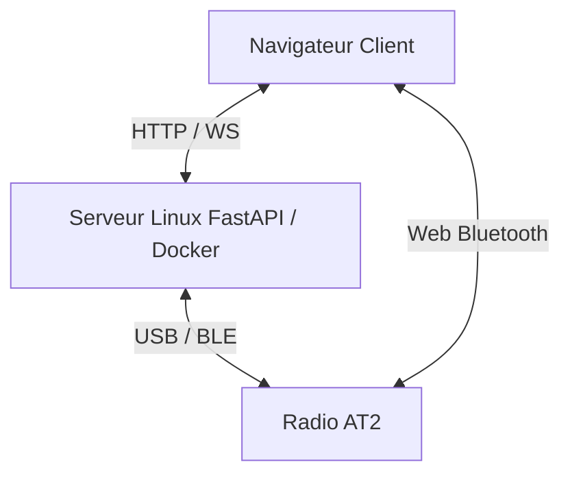

<h1 align="center">AT2 Bridge</h1>

<p align="center">
  <!-- Statut -->
  
  
  <!-- Python -->
  
  
  <!-- FastAPI -->
  
  
  <!-- Docker -->
  
  
  <!-- Tests -->
  
  
  <!-- Matériel -->
  
  
  <!-- Licence (avec lien vers ton repo) -->
  <a href="https://github.com/dx9674hnxw-spec/at2-bridge/blob/main/LICENSE">
    
  </a>

<p align="center">
  <a href="./README.md">
    
  </a>
  <a href="./README.us.md">
    
  </a>
</p>
 
</p>


Application web auto-hébergée (Docker) pour piloter une radio bidirectionnelle **Alervites/Baofeng AT2** depuis un serveur Linux, ou directement depuis le navigateur en BLE local — canaux, réglages appareil, messagerie hors-réseau (texte/image/voix), PTT temps réel, position/SOS, authentification.

> [!WARNING]
> **Projet communautaire non affilié à Baofeng/Alervites.** Protocole reconstitué par rétro-ingénierie. Aucune garantie de compatibilité totale — teste prudemment.

## Fonctionnalités

> [!TIP]
>###  Implémenté et testé (sans radio)
>
>- **Codec de trame** — Encodage/décodage `AA55 [LEN] [PAYLOAD] [CRC16] 77EE`, CRC16-CCITT (init `0x1234`, poly `0x1021`).
>- **Codec de canal** — Enregistrements 24 octets (fréquences, tons CTCSS/DCS, bande passante, puissance), round-trip testé.
>- **Codec AMR-NB (voix)** — Binding ctypes vers `libopencore-amrnb` réel, round-trip encode/decode validé.
>- **Chunking PTT temps réel** — Paquets vocaux (5 trames AMR/paquet, cadencement 100ms), format confirmé par le code source de référence.
>- **Messagerie texte/voix/image (construction + décodage + réassemblage)** — Les trois formats hors-réseau portés depuis `At2OfflineMessageCodec.kt` ; round-trip testé pour les trois types, y compris messages concurrents entrelacés et chunks orphelins.
>- **Backend FastAPI** — 32 routes HTTP + 4 WebSocket, toutes s'importent et répondent.
>- **Authentification** — Token HMAC signé, activable/désactivable via variable d'environnement, testée (émission, vérification, expiration, altération de signature).
>- **Gestion d'erreurs propre** — `RuntimeError` (ex: pas de connexion active) renvoyées en HTTP 409 clair ; toute autre erreur inattendue loggée en entier côté serveur mais sans traceback exposé au client.
>- **Stockage local** (noms de canaux, appareils connus) — Persistance JSON testée, y compris l'enregistrement automatique d'un appareil à la connexion série.
>- **33 tests unitaires** — `app/tests/test_protocol.py`.

  
> [!WARNING]
>###  Implémenté mais non testé (nécessite la radio)
>
>- **Lecture/écriture des canaux** (USB série et BLE) — jamais envoyé à une radio réelle.
>- **Lecture groupée des 30 canaux (codeplug)** — commande déduite par symétrie, non observée sur trafic réel.
>- **Réglages appareil** (volume/squelch/VOX) — seuls réglages câblés à ce jour ; jamais vérifiés sur radio.
>- **Envoi de messages texte/voix/image hors-réseau** — format testé unitairement, jamais émis vers une radio.
>- **Réception de messages hors-réseau** — décodage + WebSocket (`/ws/messages`) + affichage dans le fil de discussion entièrement câblés côté client, jamais reçu de vraie trame radio ; lecture audio des messages vocaux reçus non implémentée (affichage texte uniquement pour l'instant).
>- **PTT temps réel (voix)** — capture micro → 8kHz mono → AMR-NB → trames radio, chaîne complète jamais testée avec une radio en face.
>- **Position/SOS** — repose sur le canal de messagerie texte (pas de type structuré dédié), jamais émis en conditions réelles.
>- **Mode BLE local (Web Bluetooth)** — port JS minimal (canal, texte), jamais connecté à une radio réelle.
>- **Reconnexion aux appareils connus** — persistance fonctionnelle, reconnexion réelle non testée.
>- **Formulaire de connexion (auth frontend)** — flux complet testé côté API (login, token, 401, session expirée), jamais utilisé via l'interface réelle en conditions de terrain.

> [!CAUTION]
>###  Non implémenté / Roadmap
>
>- **Réglages avancés** (sensibilité VOX, temporisation TX, inhibition TX, réduction de bruit, tonalité de confirmation, nom d'appareil, Smart Link) — commandes déjà présentes dans `app/protocol/commands.py` (portées du protocole réel) mais volontairement non exposées à l'UI pour l'instant.
>- **Lecture audio des messages vocaux reçus** — le message arrive et s'affiche, mais aucun lecteur audio n'est encore branché côté navigateur.
>- **Type de message structuré "Position"** — actuellement du texte formaté, pas le format natif observé dans l'app Ola Radio.
>- **Gestion simultanée de plusieurs radios** — une seule connexion active à la fois côté serveur.
>- **Flux vidéo / photos périodiques** — non implémenté ; débit du protocole (≈330 o/s messagerie, 4,8 kbps PTT) rend une vraie vidéo irréaliste.
>- **Nettoyage des messages partiels abandonnés** — l'assembleur de messages entrants n'a pas de timeout si une transmission est interrompue en cours de route.

## Architecture


## Web Bluetooth

Le mode BLE local est exécuté par le navigateur de l'utilisateur. Le serveur Linux n'est pas dans le chemin Bluetooth dans ce mode : la radio doit donc être à portée Bluetooth de l'ordinateur ou du téléphone qui affiche l'interface web.

### Navigateurs compatibles

- Utiliser Chrome ou Edge sur Windows, macOS, Linux ou Android.
- Firefox ne prend pas en charge Web Bluetooth.
- Les navigateurs iOS ne prennent pas Web Bluetooth en charge, y compris Chrome et Edge sur iPhone/iPad, car ils reposent sur WebKit.
- Sur Linux, Web Bluetooth peut nécessiter l'activation de fonctionnalités expérimentales du navigateur selon le build utilisé.

### HTTPS requis

L'API Web Bluetooth exige un contexte sécurisé : HTTPS ou `localhost`.

Pour un test de développement sur un réseau local en HTTP, par exemple `http://<ip-du-serveur>:2910`, Chrome peut recevoir une exception locale :

1. Ouvrir `chrome://flags/#unsafely-treat-insecure-origin-as-secure`.
2. Ajouter l'origine exacte, par exemple :

   ```text
   http://<ip-du-serveur>:2910
   ```

3. Activer le flag puis cliquer sur **Relaunch**.
4. Recharger l'interface avec `Ctrl + F5`.

> [!CAUTION]
> Cette exception doit rester limitée à un environnement de développement ou à un réseau local maîtrisé. En usage normal, placer l'application derrière HTTPS valide est préférable.

### Démarrage du scan

1. Fermer Bluetooth LE Explorer ou toute application actuellement connectée à la radio.
2. Fermer Ola Radio ou désactiver le Bluetooth du téléphone si celui-ci peut se reconnecter automatiquement à l'AT2.
3. Désactiver/réactiver le Bluetooth sur la radio juste avant la recherche, afin de relancer son annonce BLE.
4. Ouvrir l'interface dans Chrome/Edge depuis l'appareil équipé du Bluetooth.
5. Lancer la connexion BLE locale.
6. Sélectionner un appareil de type `AT2_...`, par exemple `AT2_01A`.


## Déploiement

```bash
git clone https://github.com/dx9674hnxw-spec/at2-bridge.git
cd at2-bridge
docker compose up -d --build
```

Interface servie sur `http://<ip-du-serveur>:8000` (conteneur en `network_mode: host`).

Pour activer l'authentification, définis `AT2_BRIDGE_PASSWORD` dans l'environnement du conteneur — le frontend affiche alors un écran de connexion au premier accès. Sans cette variable, l'interface reste ouverte à quiconque atteint le serveur (à réserver à un réseau de confiance type Tailscale dans ce cas).

### Accès matériel requis

- **USB série** : port typiquement `/dev/ttyACM0` ou `/dev/ttyUSB0`, sélectionnable dans l'interface.
- **BLE (mode serveur)** : adaptateur Bluetooth sur le serveur, accès à BlueZ via D-Bus (déjà configuré dans `docker-compose.yml`).
- **BLE (mode local)** : aucun matériel serveur requis — utilise le Bluetooth de l'appareil affichant la page web.

### Développement local (sans Docker)

```bash
python -m venv .venv && source .venv/bin/activate
pip install -r requirements.txt
uvicorn app.main:app --reload
```

### Tests

```bash
python -m pytest app/tests -v
```

## Limitations connues

- Le PTT temps réel et la messagerie voix/image n'ont jamais été exercés de bout en bout avec du matériel.
- Le mode BLE local n'implémente qu'un sous-ensemble du protocole (canal, texte) ; codeplug complet et PTT restent serveur uniquement.
- Web Bluetooth indisponible sur tous les navigateurs iOS (restriction Apple/WebKit).
- Une seule connexion radio active à la fois côté serveur.
- L'authentification protège l'API et les WebSocket par token, mais reste un mot de passe partagé unique (pas de comptes multiples) ; le flux n'a été validé qu'en tests automatisés, pas en usage réel via l'interface.
- Les 7 réglages avancés du protocole (VOX sensibilité, TOT, inhibition TX, réduction de bruit, tonalité, nom d'appareil, Smart Link) existent dans le code protocole mais ne sont pas exposés à l'UI.

## Origine du protocole

Deux sources croisées, confirmant un protocole **identique** entre USB série et BLE :

1. Décompilation du CPS officiel Windows (Electron) — structure de trame et layout des canaux.
2. Code source [`Baofeng-ALERVITES-AT2-Android`](https://github.com/byf3332/Baofeng-ALERVITES-AT2-Android) (Apache-2.0) — CRC16 exact, UUID BLE réels, formats de messagerie hors-réseau (texte/voix/image) et protocole PTT temps réel.

## Licences tierces

Code porté (Kotlin → Python/JS) depuis [`Baofeng-ALERVITES-AT2-Android`](https://github.com/byf3332/Baofeng-ALERVITES-AT2-Android), Apache 2.0 — voir [`NOTICE`](./NOTICE) et [`THIRD_PARTY_NOTICES.md`](./THIRD_PARTY_NOTICES.md), y compris pour `libopencore-amrnb` (Apache 2.0).

Code propre à ce projet sous licence MIT — voir [`LICENSE`](./LICENSE).
