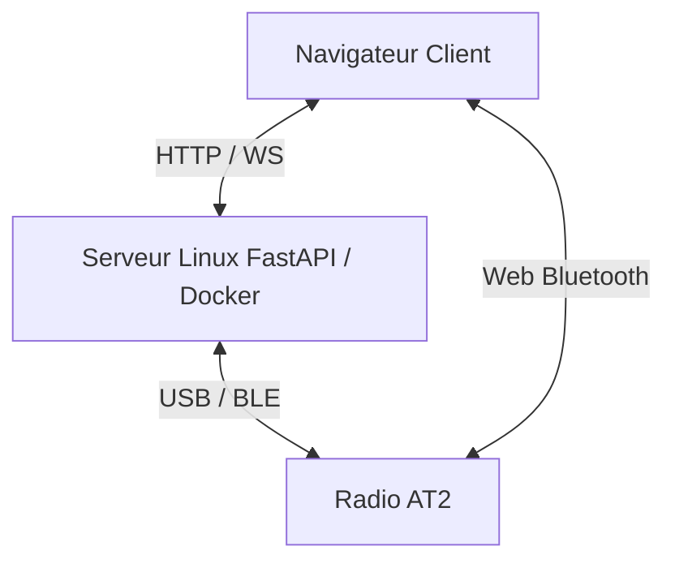

<h1 align="center">AT2 Bridge</h1>

<p align="center">
  <!-- Statut -->
  
  
  <!-- Python -->
  
  
  <!-- FastAPI -->
  
  
  <!-- Docker -->
  
  
  <!-- Tests -->
  
  
  <!-- Matériel -->
  
  
  <!-- Licence (avec lien vers ton repo) -->
  <a href="https://github.com/dx9674hnxw-spec/at2-bridge/blob/main/LICENSE">
    
  </a>

<p align="center">
  <a href="./README.md">
    
  </a>
  <a href="./README.us.md">
    
  </a>
</p>
 
</p>

Application web auto-hébergée (Docker) pour piloter une radio bidirectionnelle **Alervites/Baofeng AT2** depuis un serveur Linux, ou directement depuis le navigateur en BLE local — canaux (lecture/écriture confirmées fonctionnelles), réglages appareil, messagerie hors-réseau (texte/image/voix), PTT temps réel, position/SOS, authentification.

> [!WARNING]
> **Projet communautaire non affilié à Baofeng/Alervites.** Protocole reconstitué par rétro-ingénierie. Aucune garantie de compatibilité totale — teste prudemment.

> [!IMPORTANT]
> **Sur la distinction "accusé de réception" vs "fonctionnement confirmé" :** la radio répond à de nombreuses commandes avec un accusé de réception au niveau trame (`family | 0x80`, CRC valide). **Ceci ne prouve pas, à lui seul, que l'action a réellement eu lieu** — un exemple concret l'illustre dans ce projet : l'ancienne commande de sélection de canal obtenait un accusé cohérent, mais écrivait très probablement un tout autre paramètre (le canal de double-veille), pas le canal actif. Une fonctionnalité n'est marquée ✅ dans ce document que lorsqu'elle a été vérifiée par un moyen indépendant du protocole lui-même (relecture qui montre le changement, réception sur un second poste, comportement radio observable — l'AT2 n'a pas d'écran).

## Fonctionnalités

> [!TIP]
>###  Confirmé fonctionnel sur radio réelle
>
>- **Lecture et écriture des canaux** — canal par canal, via le dialecte de protocole retrouvé dans le CPS Windows officiel (voir "Origine du protocole" ci-dessous). Fréquences, tons CTCSS/DCS, bande passante, puissance, scan, mode analogique/digital, clé de chiffrement, busy lock, saut de fréquence : tous les champs confirmés par recoupement avec un export de configuration de la CPS officielle.
>- **Import d'un export XML de la CPS officielle** dans le tableau de canaux de l'interface (ne remplit que l'écran, n'écrit jamais automatiquement sur la radio).
>- **Messagerie texte/voix/image hors-réseau** (mode serveur) — construction, décodage et réassemblage des trois formats.
>- **Mode BLE local (Web Bluetooth)** — connexion directe navigateur↔radio sans serveur intermédiaire : sélection de canal, volume, messagerie texte, lecture/écriture de canaux.
>- **Codec de trame** (les deux dialectes du protocole, voir plus bas), codec AMR-NB (binding natif côté serveur, portage JS/WebAssembly côté navigateur), authentification par token HMAC, stockage local (noms de canaux, appareils connus), gestion d'erreurs propre (pas de traceback exposé au client).
>- **39 tests unitaires** — `app/tests/test_protocol.py`, incluant des tests dédiés utilisant les séquences d'octets réellement échangées avec le matériel comme référence.

> [!WARNING]
>###  Implémenté, en attente de confirmation matérielle
>
>- **PTT temps réel en BLE local** — encodage et décodage AMR-NB entièrement dans le navigateur (voir section dédiée plus bas). Le pipeline complet a été vérifié par un test d'intégration simulant l'API Web Bluetooth, avec le code réel du projet : trames PTT correctement construites, cadencées et transmises. **N'a cependant pas encore été confirmé sur la radio physique.**
>- **Réglages appareil autres que le volume** (squelch, VOX, temporisation TX, inhibition TX, réduction de bruit, tonalité de confirmation, nom d'appareil, Smart Link) — une commande part et un accusé revient, mais aucun n'a été vérifié par relecture indépendante.
>- **PTT temps réel en mode serveur** — jamais vérifié de bout en bout sur matériel.
>- **Réception de messages hors-réseau** — le pipeline de réception (décodage + WebSocket + affichage) est câblé côté client, mais aucune vraie trame entrante n'a encore été reçue en test.
>- **Position/SOS** — repose sur le canal de messagerie texte (aucun type "Position" structuré n'existe dans le protocole réel).
>- **Reconnexion aux appareils connus.**

> [!CAUTION]
>###  Confirmé non fonctionnel / abandonné
>
>- **Lecture ou écriture groupée du codeplug en une seule commande** — la radio ne répond strictement rien à ce type de requête. Le protocole réel fonctionne canal par canal (confirmé en décompilant le CPS Windows officiel), c'est ce que cette application utilise désormais.
>- **Ancienne commande de sélection de canal** — très probablement inopérante pour son objectif d'origine ; elle écrit vraisemblablement le canal de double-veille de la radio, pas le canal actuellement actif.

> [!CAUTION]
>###  Non implémenté / Roadmap
>
>- **Lecture audio des messages vocaux reçus** — le message arrive et s'affiche, mais aucun lecteur audio n'est encore branché côté navigateur.
>- **Type de message structuré "Position"** — actuellement du texte formaté.
>- **Gestion simultanée de plusieurs radios** — une seule connexion active à la fois côté serveur.
>- **Flux vidéo / photos périodiques** — non implémenté ; débit du protocole (≈330 o/s messagerie, 4,8 kbps PTT) rend une vraie vidéo irréaliste.
>- **Nettoyage des messages partiels abandonnés.**
>- **Import/export de profils de configuration multiples, groupes de messagerie** — en réflexion, rien de commencé.

## Le protocole : deux dialectes de trame

L'enveloppe générale (`AA55 ... 77EE`, CRC16-CCITT init `0x1234` poly `0x1021`) est commune, mais deux structures internes distinctes coexistent réellement sur le fil, selon la fonctionnalité :

- **Dialecte "legacy"** (porté du protocole BLE de l'app Android de référence) : longueur sur 1 octet, corps préfixé d'un octet `0x00`. Utilisé pour la messagerie hors-réseau, le PTT temps réel, et les réglages appareil.
- **Dialecte "CPS"** (retrouvé en décompilant le CPS Windows officiel) : longueur sur 2 octets, pas d'octet de tête. Utilisé pour la lecture/écriture de canal individuel.

Ce n'était pas évident au départ — les deux dialectes ont été pris l'un pour l'autre à plusieurs reprises pendant la phase de rétro-ingénierie avant d'être clairement distingués et confirmés séparément sur matériel réel.

## PTT en BLE local

Le PTT s'est révélé être une fonctionnalité **exclusivement BLE** : le CPS Windows officiel, qui ne gère que la programmation de codeplug, ne contient aucun code de pilotage audio en temps réel. Sans module Bluetooth sur le serveur, le PTT en mode BLE local doit donc encoder/décoder l'audio (AMR-NB) directement dans le navigateur — ce que fait ce projet via [`opencore-amr-js`](https://github.com/yxl/opencore-amr-js) (Apache 2.0), un portage WebAssembly du même codec natif déjà utilisé côté serveur.

## Architecture



## Web Bluetooth

Le mode BLE local est exécuté par le navigateur de l'utilisateur. Le serveur Linux n'est pas dans le chemin Bluetooth dans ce mode : la radio doit donc être à portée Bluetooth de l'ordinateur ou du téléphone qui affiche l'interface web.

### Navigateurs compatibles

- Utiliser Chrome ou Edge sur Windows, macOS, Linux ou Android.
- Firefox ne prend pas en charge Web Bluetooth.
- Les navigateurs iOS ne prennent pas Web Bluetooth en charge, y compris Chrome et Edge sur iPhone/iPad, car ils reposent sur WebKit.
- Sur Linux, Web Bluetooth peut nécessiter l'activation de fonctionnalités expérimentales du navigateur selon le build utilisé.

### HTTPS requis

L'API Web Bluetooth exige un contexte sécurisé : HTTPS ou `localhost`. **Le PTT en BLE local a la même exigence** pour la capture micro (`getUserMedia`), pour la même raison.

Pour un test de développement sur un réseau local en HTTP, par exemple `http://<ip-du-serveur>:2910`, Chrome peut recevoir une exception locale :

1. Ouvrir `chrome://flags/#unsafely-treat-insecure-origin-as-secure`.
2. Ajouter l'origine exacte, par exemple :

   ```text
   http://<ip-du-serveur>:2910
   ```

3. Activer le flag puis cliquer sur **Relaunch**.
4. Recharger l'interface avec `Ctrl + F5`.

> [!CAUTION]
> Cette exception doit rester limitée à un environnement de développement ou à un réseau local maîtrisé. En usage normal, placer l'application derrière HTTPS valide est préférable.

### Démarrage du scan

1. Fermer Bluetooth LE Explorer ou toute application actuellement connectée à la radio.
2. Fermer Ola Radio ou désactiver le Bluetooth du téléphone si celui-ci peut se reconnecter automatiquement à l'AT2.
3. Désactiver/réactiver le Bluetooth sur la radio juste avant la recherche, afin de relancer son annonce BLE.
4. Ouvrir l'interface dans Chrome/Edge depuis l'appareil équipé du Bluetooth.
5. Lancer la connexion BLE locale.
6. Sélectionner un appareil de type `AT2_...`, par exemple `AT2_01A`.

## Déploiement

```bash
git clone https://github.com/dx9674hnxw-spec/at2-bridge.git
cd at2-bridge
docker compose up -d --build
```

Interface servie sur `http://<ip-du-serveur>:<port>` (conteneur en `network_mode: host` ; port configurable dans `docker-compose.yml`, 8000 par défaut).

Pour activer l'authentification, définis `AT2_BRIDGE_PASSWORD` dans l'environnement du conteneur — le frontend affiche alors un écran de connexion au premier accès. Sans cette variable, l'interface reste ouverte à quiconque atteint le serveur (à réserver à un réseau de confiance type Tailscale dans ce cas).

### Accès matériel requis

- **USB série** : port typiquement `/dev/ttyACM0` ou `/dev/ttyUSB0`, sélectionnable dans l'interface.
- **BLE (mode serveur)** : adaptateur Bluetooth sur le serveur, accès à BlueZ via D-Bus (déjà configuré dans `docker-compose.yml`).
- **BLE (mode local)** : aucun matériel serveur requis — utilise le Bluetooth de l'appareil affichant la page web (voir section "Web Bluetooth" ci-dessus).

### Développement local (sans Docker)

```bash
python -m venv .venv && source .venv/bin/activate
pip install -r requirements.txt
uvicorn app.main:app --reload
```

### Tests

```bash
python -m pytest app/tests -v
```

## Limitations connues

- **Un accusé de réception au niveau trame ne prouve pas qu'une action a réellement eu lieu côté radio** — voir l'encart en haut de ce document.
- Le PTT temps réel (serveur et BLE) n'a jamais été confirmé fonctionnel de bout en bout sur matériel réel, malgré une implémentation complète et testée par ailleurs.
- Les réglages appareil autres que le volume n'ont jamais été vérifiés par relecture indépendante.
- Web Bluetooth indisponible sur tous les navigateurs iOS (restriction Apple/WebKit) et sur Firefox.
- Une seule connexion radio active à la fois côté serveur.
- L'authentification protège l'API et les WebSocket par token, mais reste un mot de passe partagé unique (pas de comptes multiples).

## Origine du protocole

Trois sources croisées :

1. Décompilation du CPS officiel Windows (Electron) — a révélé le vrai format de lecture/écriture de canal individuel (le "dialecte CPS").
2. Code source [`Baofeng-ALERVITES-AT2-Android`](https://github.com/byf3332/Baofeng-ALERVITES-AT2-Android) (Apache-2.0) — CRC16 exact, UUID BLE réels, formats de messagerie hors-réseau et protocole PTT temps réel (le "dialecte legacy").
3. Validation directe sur radio physique — lecture/écriture de canaux confirmées fonctionnelles ; export de configuration de la CPS officielle utilisé pour valider indépendamment chaque champ décodé.

## Licences tierces

Code porté (Kotlin → Python/JS) depuis [`Baofeng-ALERVITES-AT2-Android`](https://github.com/byf3332/Baofeng-ALERVITES-AT2-Android), Apache 2.0.

Codec AMR-NB : `libopencore-amrnb` côté serveur, et [`opencore-amr-js`](https://github.com/yxl/opencore-amr-js) (portage WebAssembly du même codec) côté navigateur pour le PTT en BLE local — tous deux Apache 2.0.

Voir [`NOTICE`](./NOTICE) et [`THIRD_PARTY_NOTICES.md`](./THIRD_PARTY_NOTICES.md) pour le détail complet des attributions.

Code propre à ce projet sous licence MIT — voir [`LICENSE`](./LICENSE).
