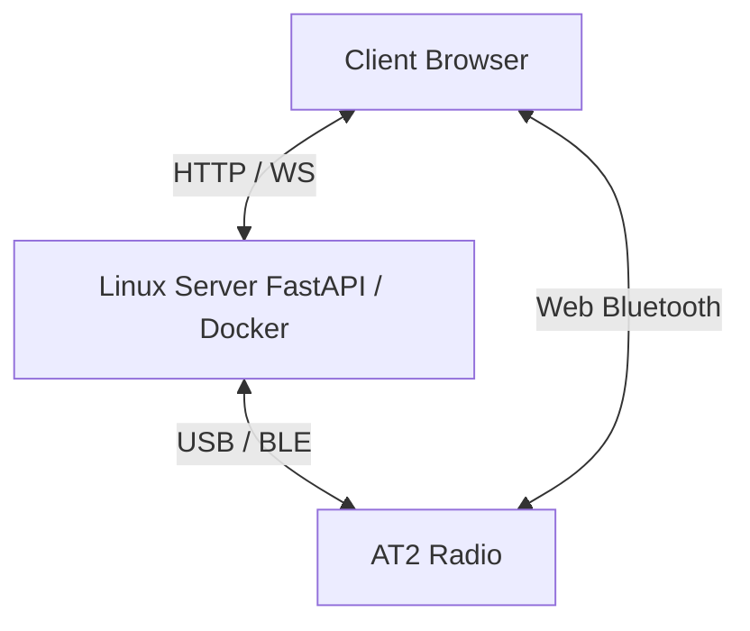

<h1 align="center">AT2 Bridge</h1>

<p align="center">
  <!-- Status -->
  
  
  <!-- Python -->
  
  
  <!-- FastAPI -->
  
  
  <!-- Docker -->
  
  
  <!-- Tests -->
  
  
  <!-- Hardware -->
  
  
  <!-- License (linked to the repo) -->
  <a href="https://github.com/dx9674hnxw-spec/at2-bridge/blob/main/LICENSE">
    
  </a>
</p>

Self-hosted web application (Docker) to control a bidirectional **Alervites/Baofeng AT2** radio from a Linux server, or directly from the browser via local BLE — channels (read/write confirmed working), device settings, offline messaging (text/image/voice), real-time PTT, position/SOS, authentication.

> [!WARNING]
> **Community project, not affiliated with Baofeng/Alervites.** Protocol reconstructed through reverse engineering. No guarantee of full compatibility — test carefully.

> [!IMPORTANT]
> **On the distinction between "acknowledgment" and "confirmed working":** the radio responds to many commands with a frame-level acknowledgment (`family | 0x80`, valid CRC). **This alone does not prove the action actually happened** — a concrete example illustrates this in this project: the old channel-selection command got a coherent acknowledgment, but very likely wrote an entirely different parameter (the dual-watch channel), not the active channel. A feature is only marked ✅ in this document once it has been verified through a means independent of the protocol itself (an independent read-back showing the change, reception on a second radio, an observable radio behavior — the AT2 has no screen).

## Features

> [!TIP]
>###  Confirmed working on real hardware
>
>- **Channel read and write** — one channel at a time, via the protocol dialect found in the official Windows CPS (see "Protocol origin" below). Frequencies, CTCSS/DCS tones, bandwidth, power, scan, analog/digital mode, encryption key, busy lock, frequency hop: every field confirmed by cross-checking against a configuration export from the official CPS.
>- **Importing an XML export from the official CPS** into the interface's channel table (only populates the screen, never writes to the radio automatically).
>- **Offline text/voice/image messaging** (server mode) — construction, decoding, and reassembly of all three formats.
>- **Local BLE mode (Web Bluetooth)** — direct browser↔radio connection with no intermediate server: channel selection, volume, text messaging, channel read/write.
>- **Frame codec** (both protocol dialects, see below), AMR-NB codec (native binding server-side, JS/WebAssembly port client-side), HMAC token authentication, local storage (channel names, known devices), clean error handling (no traceback exposed to the client).
>- **39 unit tests** — `app/tests/test_protocol.py`, including dedicated tests using byte sequences actually exchanged with the hardware as reference.

> [!WARNING]
>###  Implemented, pending hardware confirmation
>
>- **Real-time PTT in local BLE mode** — AMR-NB encoding and decoding entirely in the browser (see dedicated section below). PTT frames were correctly built, paced, and transmitted, but the radio never actually keyed up: comparing against the reference Android app revealed that a distinct "key transmitter on/off" command (`family 0x02 / command 0x04`, subtype `0x02`, plus a one-time "offline session on" subtype `0x07`) was missing entirely — voice packets alone are apparently not enough to make the radio transmit. Both commands are now sent (key-on before the first voice packet, key-off after the last) in `app/protocol/ptt.py`, `app/device.py::PttSession`, `app/static/protocol.js` and `app/static/ble-client.js`. **Still not confirmed on physical hardware** — please test and report back.
>- **Device settings other than volume** (squelch, VOX, TX timeout, TX inhibit, noise reduction, prompt tone, device name, Smart Link) — a command is sent and an acknowledgment comes back, but none has been verified by independent read-back.
>- **Real-time PTT in server mode** — same missing key-on/key-off commands as above, now added to `app/device.py::PttSession`; never verified end-to-end on hardware.
>- **Receiving offline messages** — the reception pipeline (decoding + WebSocket + display) is wired up client-side, but no real incoming frame has been received in testing yet.
>- **Position/SOS** — relies on the text messaging channel (no structured "Position" type exists in the real protocol).
>- **Reconnecting to known devices.**

> [!CAUTION]
>###  Confirmed not working / abandoned
>
>- **Bulk codeplug read or write in a single command** — the radio simply does not respond to this kind of request at all. The real protocol works one channel at a time (confirmed by decompiling the official Windows CPS), which is what this application now uses.
>- **Old channel-selection command** — very likely non-functional for its original purpose; it probably writes the radio's dual-watch channel, not the currently active channel.

> [!CAUTION]
>###  Not implemented / Roadmap
>
>- **Voice message playback** — the message arrives and displays, but no audio player is wired up in the browser yet.
>- **Structured "Position" message type** — currently formatted text.
>- **Managing multiple radios simultaneously** — only one active connection at a time server-side.
>- **Video streaming / periodic photos** — not implemented; the protocol's throughput (≈330 bytes/s for messaging, 4.8 kbps for PTT) makes real video unrealistic.
>- **Cleanup of abandoned partial messages.**
>- **Importing/exporting multiple configuration profiles, messaging groups** — under consideration, nothing started.

## The protocol: two frame dialects

The general envelope (`AA55 ... 77EE`, CRC16-CCITT init `0x1234` poly `0x1021`) is shared, but two genuinely distinct internal structures coexist on the wire, depending on the feature:

- **"Legacy" dialect** (ported from the reference Android app's BLE protocol): 1-byte length, body prefixed with a `0x00` byte. Used for offline messaging, real-time PTT, and device settings.
- **"CPS" dialect** (found by decompiling the official Windows CPS): 2-byte length, no leading byte. Used for reading/writing an individual channel.

This wasn't obvious at first — the two dialects were mistaken for one another several times during the reverse-engineering phase before being clearly distinguished and separately confirmed on real hardware.

## PTT in local BLE mode

PTT turned out to be an **exclusively BLE** feature: the official Windows CPS, which only handles codeplug programming, contains no real-time audio handling code at all. Without a Bluetooth module on the server, PTT in local BLE mode must therefore encode/decode audio (AMR-NB) directly in the browser — which this project does via [`opencore-amr-js`](https://github.com/yxl/opencore-amr-js) (Apache 2.0), a WebAssembly port of the same native codec already used server-side.

## Architecture



## Web Bluetooth

Local BLE mode runs in the user's browser. The Linux server is not in the Bluetooth path in this mode: the radio therefore needs to be within Bluetooth range of the computer or phone displaying the web interface.

### Compatible browsers

- Use Chrome or Edge on Windows, macOS, Linux, or Android.
- Firefox does not support Web Bluetooth.
- iOS browsers do not support Web Bluetooth, including Chrome and Edge on iPhone/iPad, since they rely on WebKit.
- On Linux, Web Bluetooth may require enabling experimental browser features depending on the build used.

### HTTPS required

The Web Bluetooth API requires a secure context: HTTPS or `localhost`. **PTT in local BLE mode has the same requirement** for microphone capture (`getUserMedia`), for the same reason.

For development testing on a local network over HTTP, e.g. `http://<server-ip>:2910`, Chrome can be given a local exception:

1. Open `chrome://flags/#unsafely-treat-insecure-origin-as-secure`.
2. Add the exact origin, for example:

   ```text
   http://<server-ip>:2910
   ```

3. Enable the flag, then click **Relaunch**.
4. Reload the interface with `Ctrl + F5`.

> [!CAUTION]
> This exception should stay limited to a development environment or a controlled local network. For normal use, placing the application behind valid HTTPS is preferable.

### Starting a scan

1. Close Bluetooth LE Explorer or any application currently connected to the radio.
2. Close Ola Radio or turn off the phone's Bluetooth if it might auto-reconnect to the AT2.
3. Toggle Bluetooth off/on on the radio right before scanning, to restart its BLE advertising.
4. Open the interface in Chrome/Edge from the device with the Bluetooth adapter.
5. Start the local BLE connection.
6. Select an `AT2_...` device, e.g. `AT2_01A`.

## Deployment

```bash
git clone https://github.com/dx9674hnxw-spec/at2-bridge.git
cd at2-bridge
docker compose up -d --build
```

Interface served on `http://<server-ip>:<port>` (container runs in `network_mode: host`; port configurable in `docker-compose.yml`, 8000 by default).

To enable authentication, set `AT2_BRIDGE_PASSWORD` in the container's environment — the frontend then shows a login screen on first access. Without this variable, the interface stays open to anyone who can reach the server (restrict to a trusted network such as Tailscale in that case).

### Required hardware access

- **USB serial**: port typically `/dev/ttyACM0` or `/dev/ttyUSB0`, selectable in the interface.
- **BLE (server mode)**: Bluetooth adapter on the server, BlueZ access via D-Bus (already configured in `docker-compose.yml`).
- **BLE (local mode)**: no server-side hardware required — uses the Bluetooth of the device displaying the web page (see the "Web Bluetooth" section above).

### Local development (without Docker)

```bash
python -m venv .venv && source .venv/bin/activate
pip install -r requirements.txt
uvicorn app.main:app --reload
```

### Tests

```bash
python -m pytest app/tests -v
```

## Known limitations

- **A frame-level acknowledgment does not prove an action actually happened on the radio** — see the note near the top of this document.
- Real-time PTT (server and BLE) has never been confirmed working end-to-end on real hardware, despite a complete and otherwise-tested implementation.
- Device settings other than volume have never been verified by independent read-back.
- Web Bluetooth unavailable on all iOS browsers (Apple/WebKit restriction) and on Firefox.
- Only one active radio connection at a time server-side.
- Authentication protects the API and WebSockets via token, but remains a single shared password (no multi-user accounts).

## Protocol origin

Three cross-referenced sources:

1. Decompiling the official Windows CPS (Electron) — revealed the real format for reading/writing an individual channel (the "CPS dialect").
2. Source code of [`Baofeng-ALERVITES-AT2-Android`](https://github.com/byf3332/Baofeng-ALERVITES-AT2-Android) (Apache-2.0) — exact CRC16, real BLE UUIDs, offline messaging formats, and real-time PTT protocol (the "legacy dialect").
3. Direct validation on physical hardware — channel read/write confirmed working; a configuration export from the official CPS used to independently validate each decoded field.

## Third-party licenses

Code ported (Kotlin → Python/JS) from [`Baofeng-ALERVITES-AT2-Android`](https://github.com/byf3332/Baofeng-ALERVITES-AT2-Android), Apache 2.0.

AMR-NB codec: `libopencore-amrnb` server-side, and [`opencore-amr-js`](https://github.com/yxl/opencore-amr-js) (a WebAssembly port of the same codec) client-side for PTT in local BLE mode — both Apache 2.0.

See [`NOTICE`](./NOTICE) and [`THIRD_PARTY_NOTICES.md`](./THIRD_PARTY_NOTICES.md) for the full attribution details.

This project's own code is licensed under MIT — see [`LICENSE`](./LICENSE).
