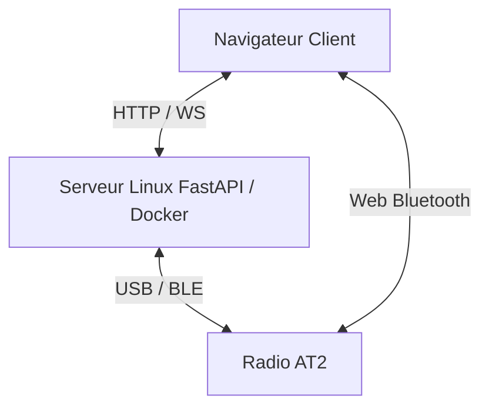

<h1 align="center">AT2 Bridge</h1>

<p align="center">
  <!-- Statut -->
  
  
  <!-- Python -->
  
  
  <!-- FastAPI -->
  
  
  <!-- Docker -->
  
  
  <!-- Tests -->
  
  
  <!-- Matériel -->
  
  
  <!-- Licence (avec lien vers ton repo) -->
  <a href="https://github.com/dx9674hnxw-spec/at2-bridge/blob/main/LICENSE">
    
  </a>

<p align="center">
  <a href="./README.md">
    
  </a>
  <a href="./README.us.md">
    
  </a>
</p>
 
</p>


Self-hosted web application (Docker) for controlling an Alervites/Baofeng AT2 two-way radio from a Linux server or directly from a browser via local BLE—channels, device settings, off-network messaging (text/image/voice), real-time PTT, location/SOS, and authentication.

> [!WARNING]
> **Community project not affiliated with Baofeng/Alervites.** Protocol reconstructed through reverse engineering. No guarantee of full compatibility—test with caution.

## Features

> [!TIP]
>###  Implemented and tested (without radio)
>
>- **Frame codec** — Encoding/decoding `AA55 [LEN] [PAYLOAD] [CRC16] 77EE`, CRC16-CCITT (init `0x1234`, poly `0x1021`).
>- **Channel codec** — 24-byte records (frequencies, CTCSS/DCS tones, bandwidth, power), round-trip tested.
>- **AMR-NB (voice) codec** — ctypes binding to the actual `libopencore-amrnb`, round-trip encoding/decoding validated.
>- **Real-time PTT chunking** — Voice packets (5 AMR frames per packet, 100 ms timing), format confirmed by the reference source code.
>- **Text/voice/image messaging (construction + decoding + reassembly)** — The three off-network formats ported from `At2OfflineMessageCodec.kt`; round-trip testing performed for all three types, including interleaved concurrent messages and orphaned chunks.
>- **FastAPI Backend** — 32 HTTP routes + 4 WebSockets, all of which import and respond.
>- **Authentication** — Signed HMAC token, enabled/disabled via environment variable, tested (issuance, verification, expiration, signature tampering).
>- **Clean error handling** — `RuntimeError` (e.g., no active connection) returned as a plain HTTP 409; all other unexpected errors are logged in full on the server side but without exposing the traceback to the client.
>- **Local storage** (channel names, known devices) — JSON persistence tested, including automatic registration of a device upon serial connection.
>- **33 unit tests** — `app/tests/test_protocol.py`.

  
> [!WARNING]
>###  Implemented but not tested (requires radio)
>
>- **Channel read/write** (USB serial and BLE) — never sent to an actual radio.
>- **Batch read of all 30 channels (codeplug)** — command inferred by symmetry; not observed in actual traffic.
>- **Device settings** (volume/squelch/VOX) — the only settings hard-coded to date; never verified on a radio.
>- **Sending text/voice/image messages outside the network** — format tested in unit tests, never transmitted to a radio.
>- **Receiving off-network messages** — decoding + WebSocket (`/ws/messages`) + display in the chat feed are fully implemented on the client side; no actual radio frames have ever been received; audio playback of received voice messages not implemented (text display only for now).
>- **Real-time PTT (voice)** — microphone capture → 8 kHz mono → AMR-NB → radio frames; full chain never tested with a radio on the other end.
>- **Location/SOS** — relies on the text messaging channel (no dedicated structured type); never transmitted under real-world conditions.
>- **Local BLE mode (Web Bluetooth)** — minimal JS port (channel, text); never connected to an actual radio.
>- **Reconnection to known devices** — functional persistence; actual reconnection not tested.
>- **Login form (frontend auth)** — full flow tested on the API side (login, token, 401, expired session), never used via the actual interface in field conditions.

> [!CAUTION]
>###  Not implemented / Roadmap
>
>- **Advanced Settings** (VOX sensitivity, TX delay, TX inhibit, noise reduction, confirmation tone, device name, Smart Link) — commands already present in `app/protocol/commands.py` (part of the actual protocol) but intentionally not exposed to the UI at this time.
>- **Audio playback of received voice messages** — the message arrives and is displayed, but no audio player is yet connected on the browser side.
>- **“Position” structured message type** — currently formatted text, not the native format seen in the Ola Radio app.
>- **Simultaneous management of multiple radios** — only one active connection at a time on the server side.
>- **Periodic video/photo streams** — not implemented; the protocol’s throughput (≈330 messages/s, 4.8 kbps PTT) makes true video unrealistic.
>- **Cleaning up abandoned partial messages** — the incoming message assembler has no timeout if a transmission is interrupted midway.

## Architecture


## Web Bluetooth

Local BLE mode is run by the user's browser. The Linux server is not part of the Bluetooth path in this mode; therefore, the radio must be within Bluetooth range of the computer or phone displaying the web interface.

### Compatible browsers

- Use Chrome or Edge on Windows, macOS, Linux, or Android.
- Firefox does not support Web Bluetooth.
- iOS browsers do not support Web Bluetooth, including Chrome and Edge on iPhone/iPad, because they are based on WebKit.
- On Linux, Web Bluetooth may require enabling experimental browser features, depending on the build you are using.

### HTTPS required

The Web Bluetooth API requires a secure context : HTTPS ou `localhost`.

When testing a development environment on a local network using HTTP—for example, `http://<server-ip>:2910`—Chrome may encounter a local exception:

1. Open `chrome://flags/#unsafely-treat-insecure-origin-as-secure`.
2. Add the exact origin, for example:

   ```text
   http://<ip-du-serveur>:2910
   ```

3. Check the box, then click **Relaunch**.
4. Refresh the interface using `Ctrl + F5`.

> [!CAUTION]
> This exception should be limited to a development environment or a controlled local network. Under normal circumstances, it is preferable to place the application behind valid HTTPS.

### Démarrage du scan

1. Close Bluetooth LE Explorer or any app currently connected to the radio.
2. Close Ola Radio or turn off Bluetooth on your phone if it can automatically reconnect to the AT2.
3. Turn Bluetooth off and then back on on the radio just before starting the search, to restart its BLE broadcast.
4. Open the interface in Chrome/Edge on the Bluetooth-enabled device.
5. Initiate the local BLE connection.
6. Select a device of the type `AT2_...`, for example `AT2_01A`.


## Deployment

```bash
git clone https://github.com/dx9674hnxw-spec/at2-bridge.git
cd at2-bridge
docker compose up -d --build
```

The interface is served at `http://<server-ip>:8000` (container in `network_mode: host`).

To enable authentication, set `AT2_BRIDGE_PASSWORD` in the container's environment—the frontend will then display a login screen upon first access. Without this variable, the interface remains open to anyone who reaches the server (in this case, it should be reserved for a trusted network such as Tailscale).

### Hardware Requirements

- **USB serial**: typically the `/dev/ttyACM0` or `/dev/ttyUSB0` port, selectable in the interface.
- **BLE (server mode)**: Bluetooth adapter on the server, access to BlueZ via D-Bus (already configured in `docker-compose.yml`).
- **BLE (local mode)**: no server hardware required—uses the Bluetooth of the device displaying the web page.

### Développement local (sans Docker)

```bash
python -m venv .venv && source .venv/bin/activate
pip install -r requirements.txt
uvicorn app.main:app --reload
```

### Tests

```bash
python -m pytest app/tests -v
```

## Known Limitations

- Real-time PTT and voice/video messaging have never been tested end-to-end using hardware.
- Local BLE mode implements only a subset of the protocol (channel, text); full codeplug and PTT remain server-only.
- Web Bluetooth is unavailable on all iOS browsers (Apple/WebKit restriction).
- Only one active radio connection at a time on the server side.
- Authentication protects the API and WebSockets via a token, but remains a single shared password (no multiple accounts); the flow has only been validated in automated tests, not in actual use via the interface.
- The 7 advanced protocol settings (VOX sensitivity, TOT, TX inhibit, noise reduction, tone, device name, Smart Link) exist in the protocol code but are not exposed to the UI.

## Origin of the Protocol

Two independent sources confirm an **identical** protocol between USB Serial and BLE:

1. Decompilation of the official Windows CPS (Electron) — frame structure and channel layout.
2. Source code [`Baofeng-ALERVITES-AT2-Android`](https://github.com/byf3332/Baofeng-ALERVITES-AT2-Android) (Apache-2.0) — Exact CRC16, real BLE UUIDs, off-network messaging formats (text/voice/image), and real-time PTT protocol.

## Third-Party Licenses

Code ported (Kotlin → Python/JS) from [`Baofeng-ALERVITES-AT2-Android`](https://github.com/byf3332/Baofeng-ALERVITES-AT2-Android), Apache 2.0 — see [`NOTICE`](./NOTICE) and [`THIRD_PARTY_NOTICES.md`](./THIRD_PARTY_NOTICES.md), including for `libopencore-amrnb` (Apache 2.0).

Code specific to this project is licensed under the MIT License — see [`LICENSE`](./LICENSE).
